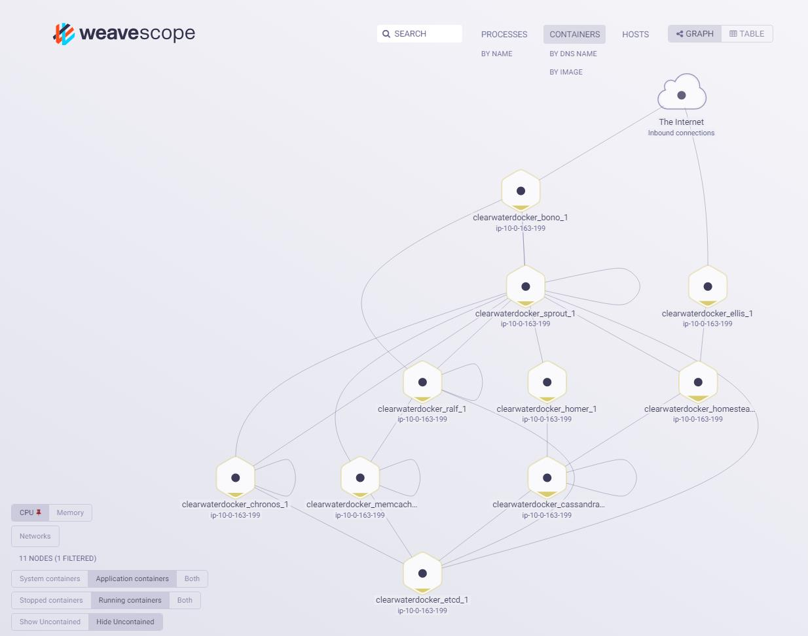

Project Clearwater is backed by Metaswitch Networks.  We have discontinued active support for this project as of 1st December 2019.  The mailing list archive is available in GitHub.  All of the documentation and source code remains available for the community in GitHub.  Metaswitch’s Clearwater Core product, built on Project Clearwater, remains an active and successful commercial offering.  Please contact clearwater@metaswitch.com for more information. Note – this email is for commercial contacts with Metaswitch.  We are no longer offering support for Project Clearwater via this contact.

# Clearwater Docker

This repository contains instructions and resources for deploying [Project Clearwater](http://www.projectclearwater.org) as [Docker](https://www.docker.com/) containers.  It describes three deployment options -- the first two are recommended.

- Using [Docker Compose](https://docs.docker.com/compose/) for quick deployments on a single host.
- Using [Kubernetes](https://kubernetes.io/) for orchestrated deployments on clusters of machines.
- By deploying the containers manually.

You should follow the "Common Preparation" section, then either the "Using Compose", "Using Kubernetes" or the "Manual Turn-Up" section.

## Common Preparation

When using the `3.13.0-74-generic` kernel, we've seen [an issue](https://github.com/Metaswitch/clearwater-docker/issues/24) which causes Clearwater not to start properly. If you are using this kernel (`uname -r` will tell you), you should install a newer kernel (e.g. with `sudo apt-get install linux-image-3.13.0-87-generic`) and reboot.

To prepare your system to deploy Clearwater on Docker, run:

    # Install Docker (on Ubuntu).
    wget -qO- https://get.docker.com/ | sh

    # Checkout clearwater-docker.
    # Either:
    git clone --recursive git@github.com:Metaswitch/clearwater-docker.git
    # Or:
    git clone --recursive https://github.com/Metaswitch/clearwater-docker.git

If deploying with compose or manually
- edit clearwater-docker/.env so that PUBLIC_IP is set to an IP address that can be used by SIP clients to access the docker host.  E.g. if you are running in AWS, this wants to be the public IP of your AWS VM.  Note: this file is not used when deploying on Kubernetes.
- if you want to be able to monitor your Docker deployment via a web UI then you might like to install and run [Weave Scope](https://www.weave.works/products/weave-scope/).  This only takes a minute to [install](https://www.weave.works/install-weave-scope/) and provides real time visualizations showing all of your containers, their resource usage and the connectivity between them.

By default Docker images built using clearwater-docker will pull the latest stable versions of Clearwater packages from http://repo.cw-ngv.com/stable.  If you check out the latest stable branch of clearwater-docker e.g. release-XXX then this should be fine.  If you are using the master branch of clearwater-docker then it will sometimes be dependent upon the latest Clearwater packages.  To use these instead update base/Dockerfile to reference http://repo.cw-ngv.com/latest instead before building the base Docker image.



## Limitations

Note that scaling of Docker deployments is a work in progress and there are currently a number of known issues...

* Homestead-prov and Ellis don’t load balance across multiple Cassandra nodes.

* In general deleting pods from storage clusters (Cassandra, Chronos or Astaire) is not supported.  Pods that are deleted will not get removed from the clusters and the clusters will end up broken.  The exception is when deployed under Kubernetes -- in this scenario Chronos and Astaire pods can be terminated, so long as this is done gracefully such that their prestop event hook is executed.  This means that Astaire and Chronos clusters (under Kubernetes) can be dynamcially scaled up and down.

## Using Compose

There is a [Compose file](minimal-distributed.yaml) to instantiate a minimal (non-fault-tolerant) distributed Clearwater deployment under Docker.
  - 104.155.15.20

#### Preparation

To prepare your system to deploy Clearwater using Compose, after running the common preparation steps above, run:

    # Install Docker Compose (on Ubuntu).
    sudo apt-get install python-pip -y
    sudo pip install -U docker-compose

    # Build the base Clearwater docker image.
    cd clearwater-docker
    sudo docker build -t clearwater/base base
    sudo docker-compose -f minimal-distributed.yaml build

Note that Compose will name each image like `${IMAGE_PREFIX}/<node_name>` and `IMAGE_PREFIX=clearwater` by default. If you need to specify your registry, please edit `IMAGE_PREFIX` in `clearwater-docker/.env` like `IMAGE_PREFIX=<your_registry>/clearwater`.

#### Starting Clearwater

To start the Clearwater services, run:

    # Build all the other Clearwater Docker images and start a deployment.
    sudo docker-compose -f minimal-distributed.yaml up -d

#### Scaling the deployment

Having started up a deployment, it is then possible to scale it by adding or removing additional nodes.  E.g. run

    sudo docker-compose -f minimal-distributed.yaml scale sprout=2 astaire=2 chronos=2 cassandra=2

Note that it is not possible to scale *down* storage node clusters -- see limitations above.

If you scale *up* the clusters of storage nodes, you can monitor progress as new nodes join the clusters by running `utils/show_cluster_state.sh`.

## Using Kubernetes

Instead of using Docker Compose, you can deploy Clearwater in Kubernetes. This requires a Kubernetes cluster, and a Docker repository.

### Prepare the images and edit the yaml files

- First, build all the required images locally.

        # Build the Clearwater docker images.
        cd clearwater-docker
        for i in base astaire cassandra chronos bono ellis homer homestead homestead-prov ralf sprout ; do docker build -t clearwater/$i $i ; done

- Next, push them to your repository (which must be accessible from the Kubernetes deployment)

        for i in base astaire cassandra chronos bono ellis homer homestead homestead-prov ralf sprout
        do
            docker tag clearwater/$i:latest path_to_your_repo/clearwater/$i:latest
            docker push path_to_your_repo/clearwater/$i:latest
        done

- Create an `env-vars` config map.
  - At a minimum this must include a ZONE key set to the domain of your Kubernetes cluster e.g. `default.svc.cluster.local`
  - If you wish to use an HSS (instead of Ellis and Homestead-prov) then you can also include an HSS key with a value equal to the name of the HSS node: this will result in the deployment being configured to use the HSS at `<HSS key>.<ZONE key>`, with an HSS realm of `<ZONE key>`.  If you want to use an HSS in a different domain then you will have to manually configure the appropriate values -- see below.
  - It may also include an ADDITIONAL_SHARED_CONFIG key whose value includes additional shared config settings that you want to use.   These will override any auto-generated settings.  E.g. this can be used to specify an HSS in a different domain.  Multiple settings should be separated with `\\n`

  e.g. `kubectl create configmap env-vars --from-literal=ZONE=default.svc.cluster.local --from-literal=ADDITIONAL_SHARED_CONFIG=hss_hostname=hss.example.com\\nhss_realm=example.com`

- If you're using a private container registry (one that requires credentials to pull images from), create a secret with the required credentials. e.g. `kubectl create secret docker-registry myregistrykey --docker-server=$DOCKER_REGISTRY_SERVER --docker-username=$DOCKER_USER --docker-password=$DOCKER_PASSWORD --docker-email=$DOCKER_EMAIL`
- Update the Kubernetes yaml to match your deployment.

  - Generate the Kubernetes yaml files from the templates by going to the kubernetes directory and running `./k8s-gencfg --image_path=<path to your repo> --image_tag=<tag for the images you want to use>`
    If you're using a private container registry, add the argument `--image_secret=myregistrykey` (where `myregistrykey` matches the secret you made earlier)
    The script assumes that the Clearwater images that you want to use are located at {{image_path}}/\<image name e.g. bono\>:{{image_tag}}. It will also generate a helm chart in `/kubernetes/clearwater`.

  - Decide how you want to access Bono and Ellis from outside of the cluster.

    The default configuration assumes that you have configured your network such that your SIP endpoints (and whatever devices you will access Ellis from) can
    - connect directly to the IP addresses that Kubernetes assigns to your pods
    - resolve interal kubernetes DNS records (typically as a result of an external DNS server delegating requests for the appropriate domain to the Kubernetes DNS service)

    If this is the case then you do not need to make any changes here.  SIP devices can register with bono.<ZONE>:5060 and the Ellis provisioning interface can be accessed at http://ellis.<ZONE>.  If these requirements are not met then you will need to arrange alternative means to access Bono and Ellis -- see below for an example of how this can be done on e.g. GKE.

#### Alternative configuration for exposing Bono and Ellis services

If the above requirements are not met (external devices cannot resolve Kubernetes DNS entries and/or cannot directly access pod IP addresses) then an alternative mechanism must be used to access Ellis and Bono.

  - To expose Ellis, you can simply set it up as a NodePort service:
    - Replace `clusterIP: None` in ellis-svc.yaml with `type: NodePort`, and add a line to the "http" port configuration specifying `nodePort: <port number>`
    - Depending on your platform you may need to manually create a firewall rule to allow access to this port.  E.g. on GKE this can be done from the command line using gcloud if you have it installed.  e.g.
        `gcloud compute firewall-rules create ellis --allow tcp:30080`
    - The Ellis provisioning interface can then be accessed on http:<IP address of any Kubernetes node>:30080
  - If you are unable to access the Ellis web interface (e.g. this happens with [AKS](https://docs.microsoft.com/en-us/azure/aks/)) then you should instead replace `clusterIP: None` with `type: LoadBalancer`.

  - Bono is more challenging to expose due to the following requirements:
    - Each Bono pod must be configured with an externally routable IP address by which that specific pod can be uniquely accessed. Bono will record-route itself in SIP messages using this IP and susbequent SIP messages to that IP address must be guaranteed to hit the same Bono instance.
    - Port 5060 in the Bono pod must be accessible via port 5060 on the external IP address.  It is not possible to e.g. NAT port 5060 in the pod to port 30060 on the external IP.  This is because Bono always record-route's itself in SIP messages as <PUBLIC_IP>:5060.

    On e.g. [GKE](https://cloud.google.com/kubernetes-engine/) the easiest solution is to use a LoadBalancer with a statically assigned external IP address. This brings in the following limitations:
    - you can only have a single Bono instance (as subsequent SIP requests in a session must be guaranteed to be routed back to the same Bono instance so you cannot have the load balancer balance across multiple Bonos)
    - the deployment can only support SIP over UDP or SIP over TCP (not both simultaneously) as Bono cannot have separate external IP addresses for each of UDP and TCP, and a single Kubernetes LoadBalancer service can't support multiple protocols.  By default bono-svc.yaml is configured to expose SIP over TCP.

    If using [AKS](https://docs.microsoft.com/en-us/azure/aks/)
    - You must disable [HTTP Application routing](https://docs.microsoft.com/en-us/azure/aks/http-application-routing) when creating the cluster
    - you must replace `clusterIP: None` with `type: LoadBalancer` in `bono-svc.yaml`.

    For GKE and other platforms you must:
    - Have a static external IP address available that the load balancer can use (e.g. on GKE you must explicitly provision this first)
    - Replace `clusterIP: None` in bono-svc.yaml with `type: "LoadBalancer"`, and add a line following this of `loadBalancerIP: <static IP>`
    - Add the lines `name: PUBLIC_IP` and `value: <static IP>` to the `env:` section of the bono-depl.yaml file

### Deploy Clearwater in Kubernetes

#### Using kubectl

To deploy the images, you should simply run `kubectl apply -f clearwater-docker/kubernetes`.  It may take a minute or so before the deployment is fully established, the load balancer is created, and the deployment is ready to accept calls.

Note this will deploy all containers.  If you don't need e.g. Bono, Homestead-prov, Ellis etc. then just move the corresponding svc and depl files out of the directory before running the create command.

#### Using helm

Run `helm install clearwater` inside `kubernetes` directory to deploy.

### Run live tests against the deployment

If you have deployed using the standard configuration then you can run the [clearwater-live-tests](https://github.com/Metaswitch/clearwater-live-test/) against the deployment using e.g.

```
rake test[default.svc.cluster.local] PROXY="bono.default.svc.cluster.local" SIGNUP_CODE=secret
```

If you have had to expose Bono and Ellis in a non-standard manner, you may need to change the `PROXY` argument, and add an `ELLIS` argument, so that the test scripts are able to access these services. e.g.

```
rake test[default.svc.cluster.local] PROXY={{Bono service DNS/IP}} ELLIS={{Ellis service/IP}} SIGNUP_CODE=secret
```

### Scaling the deployment

Most Clearwater services can be dynamically scaled up and down by running e.g.
`kubectl scale deployment sprout --replicas=3`
Exceptions are:
- You can only have a single Bono if Bono pods do not have externally routable IP addresses.
- Astaire and Chronos clusters can be scaled up and down so long as pods are terminated in such a way that their prestop hook is executed.
- The Cassandra cluster can be scaled up but not down.
See general limitations above.

After scaling the Chronos, Astaire or Cassandra clusters you should wait for the clusters to stabilise before performing another scaling operation.  You can monitor cluster state by running cw-check_cluster_state in a pod belonging to any of the clusters.

## Manual Turn-Up

If you can't or don't want to use Compose, you can turn the deployment up manually under Docker.

#### Preparation

To prepare your system to deploy Clearwater without using Compose, after running the common preparation steps above, run:

    # Build the Clearwater docker images.
    cd clearwater-docker
    for i in base astaire cassandra chronos bono ellis homer homestead homestead-prov ralf sprout ; do sudo docker build -t clearwater/$i $i ; done

#### Starting Clearwater

To start the Clearwater services, run:

    sudo docker network create --driver bridge clearwater_nw
    sudo docker run -d --net=clearwater_nw --name etcd quay.io/coreos/etcd:v2.2.5 -name etcd0 -advertise-client-urls http://etcd:2379,http://etcd:4001 -listen-client-urls http://0.0.0.0:2379,http://0.0.0.0:4001 -initial-advertise-peer-urls http://etcd:2380 -listen-peer-urls http://0.0.0.0:2380  -initial-cluster etcd0=http://etcd:2380 -initial-cluster-state new
    sudo docker run -d --net=clearwater_nw --name astaire -p 22 clearwater/astaire
    sudo docker run -d --net=clearwater_nw --name cassandra -p 22 --sysctl net.ipv6.conf.lo.disable_ipv6=0 clearwater/cassandra
    sudo docker run -d --net=clearwater_nw --name chronos -p 22 clearwater/chronos
    sudo docker run -d --net=clearwater_nw --name homestead -p 22 clearwater/homestead
    sudo docker run -d --net=clearwater_nw --name homestead-prov -p 22 clearwater/homestead-prov
    sudo docker run -d --net=clearwater_nw --name homer -p 22 clearwater/homer
    sudo docker run -d --net=clearwater_nw --name ralf -p 22 clearwater/ralf
    sudo docker run -d --net=clearwater_nw --network-alias=icscf.sprout --network-alias=scscf.sprout --name sprout -p 22 clearwater/sprout
    sudo docker run -d --net=clearwater_nw --name bono --env-file .env -p 22 -p 3478:3478 -p 3478:3478/udp -p 5060:5060 -p 5060:5060/udp -p 5062:5062 clearwater/bono
    sudo docker run -d --net=clearwater_nw --name ellis -p 22 -p 80:80 clearwater/ellis

The Clearwater Docker images use DNS for service discovery - they require, for example, that the name "ellis" should resolve to the Ellis container's IP address. In standard Docker, user-defined networks include [an embedded DNS server](https://docs.docker.com/engine/userguide/networking/dockernetworks/#docker-embedded-dns-server) which guarantees this (and this is why we create the clearwater_nw network) - and this type of DNS server is relatively common (for example, [Kubernetes provides something similar](http://kubernetes.io/docs/user-guide/services/#dns)).

#### Scaling the deployment

It is possible to spin up additional Sprout, Cassandra, Astaire and Chronos nodes simply by repeating the relevant command `docker run` command but providing a different name.  E.g.

    sudo docker run -d --net=clearwater_nw --name astaire_2 -p 22 clearwater/astaire

Scaling of clearwater-docker deployments is work in progress though, so see the limitations described above (for scaling using Compose).

## Exposed Services

The deployment exposes

-   the Ellis web UI on port 80 (exposed on port 8080) for self-provisioning - the signup key is "secret"
-   STUN/TURN on port 3478 for media relay
-   SIP on port 5060 for service
-   SIP/WebSocket on port 5062 for service.

Additionally, each node exposes SSH - use `sudo docker ps` to see what port its exposed on.  The username/password is root/root.  Alternatively you can run a bash session in a container by name using e.g. `sudo docker exec -it <container_name> bash`

## What Next?

Once you've turned up the deployment, you can test it by

-   [making a call](http://clearwater.readthedocs.org/en/latest/Making_your_first_call.html) - make sure you configure your SIP clients with a proxy, as if it were an All-in-One node
-   [running the live tests](http://clearwater.readthedocs.org/en/latest/Running_the_live_tests.html) - again, set the PROXY and ELLIS elements, as if it were an All-in-One node.

## Utilities

There are a few scripts that offer short cuts to querying aspects of your deployment:

    # Show an abbreviated version of docker ps that fits without wrapping on smaller terminals
    utils/short_ps.sh

    # Show the IP addresses of the containers in your deployment
    utils/show_ips.sh

    # Query Chronos nodes over SNMP to get the number of active registrations
    utils/show_registration_count.sh

    # Show information about the state of the storage clusters
    utils/show_cluster_state.sh

If one of your pods is failing and you can't `exec` into it because it's in a crash loop, just run `kubectl logs` on the sidecar instead. e.g.

    kubectl logs astaire-7b74ff8df9-5lhz6 -c tailer

## Cleaning Up

If you wish to destroy your deployment either to redeploy with a different configuration or version or to free up resources on your docker host, the following may be useful commands:

    # To rebuild an image (rather than pull it from the cache), add `--no-cache` or `--force-recreate` to the build commands
    sudo docker build --no-cache -t clearwater/base base
    sudo docker-compose -f minimal-distributed.yaml build
    sudo docker-compose -f minimal-distributed.yaml up --force-recreate

    # Remove all docker containers (not just Clearwater ones!)
    sudo docker rm $(sudo docker ps -aq)

    # Remove all the docker image files (not just Clearwater ones!)
    sudo docker rmi $(sudo docker images -aq)

    # Remove most of the docker image files, but not the Ubuntu 14.04 base
    # image, use this if you intend to redeploy the clearwater deployment
    # immediately to save time.
    #
    # This command will report an error due to a conflict, this can be safely
    # ignored.
    sudo docker rmi $(sudo docker images -a | tail -n +2 | grep -v "14.04" | tr -s ' ' | cut -f3 -d' ')
